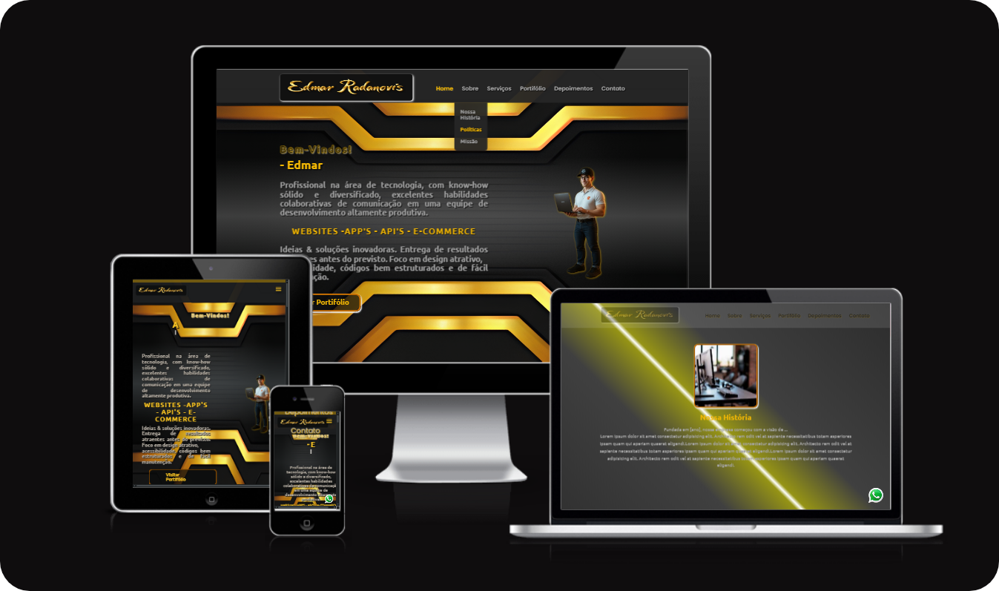
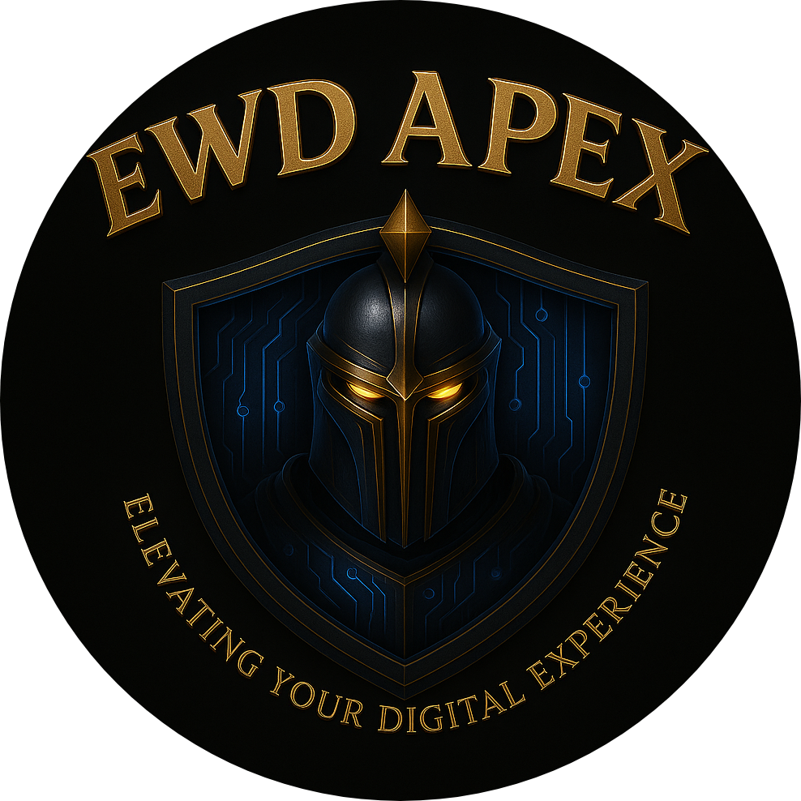

# Responsive Navigation Menu Using Front-End Development with HTML CSS JavaScript

## Course: Software Engineering

### Activity: for grade in the Responsive Development course

Course taught by _Anderson Emidio de Macedo Gonçalves_ - Master in Education and Technology.
<br>

Below is the result of the completed project:
<br>

> 🎯 Objective:
>
> - I developed this mini front-end application **_`"Responsive Menu"`_** as part of the _Responsive Development_ course (Unit U3, Class A2) of the aforementioned course. The project focuses on creating a responsive and interactive navigation menu using pure **_[HTML](https://developer.mozilla.org/en-US/docs/Web/HTML)_** , **_[CSS](https://developer.mozilla.org/en-US/docs/Web/CSS)_** and **_[JavaScript](https://developer.mozilla.org/en-US/docs/Web/JavaScript)_**. The menu adapts seamlessly to various screen sizes—smartphones, tablets (portrait and landscape), _Full HD_ (1920px+), and _4K_ (3840px+) with features like a _hamburger toggle_, _dropdown submenus_, **_smooth animations_**, and **_accessibility_** enhancements. ✅

> - This project honed my skills in responsive design using **CSS media queries**, _DOM_ manipulation with _JavaScript_, and the implementation of interactive elements to boost _usability_ and _accessibility_. Leveraging **semantic** HTML and modern CSS techniques, I enhanced my ability to craft layouts that perform efficiently across devices, a key asset in today’s web development landscape. ✅
>   > - The lightweight, framework-free approach, combined with practical guidance from the course, made this a rewarding and educational experience, reinforcing my commitment to delivering high-quality, optimized web solutions.

<br>

### 🚀 Features

- Create a responsive navigation menu adapting to smartphones, tablets (portrait and landscape), Full HD (1920px+), and 4K (3840px+) screens
- Implement a hamburger toggle button for mobile devices
- Display dropdown submenus with smooth animations
- Highlight the currently selected menu item
- Ensure automatic closure of other submenus when opening a new one
- Provide an accessible and user-friendly interface with semantic HTML

<br>

<p align="center">

</p>
<div align="center">
 <a href="https://ed-radanovis.github.io/Eng_Software_U3-A2_05-2025/" >Click here to try it out .. thanks for your interest!</a>
 <p>( 🖱️ Ctrl + click to open in a new tab )</p>
</div>
 <p align="center">

</p>
<br>

### Adjustments and improvements

The project was fully completed and some of the resources used were:

- [x] **Frontend**:&nbsp;&nbsp;&nbsp;&nbsp;&nbsp;&nbsp;[](https://developer.mozilla.org/en-US/docs/Web/HTML) &nbsp;&nbsp;[](https://developer.mozilla.org/en-US/docs/Web/CSS)&nbsp;&nbsp;[](https://developer.mozilla.org/en-US/docs/Web/JavaScript)
      <br>

- [x] **Development Tools and Testing**:&nbsp;&nbsp;&nbsp;[](https://marketplace.visualstudio.com/items?itemName=ritwickdey.LiveServer)&nbsp;&nbsp;`Manual testing with Browser DevTools`
      <br>

- [x] **Hosting and Deployment**:&nbsp;&nbsp;&nbsp;&nbsp;&nbsp;&nbsp;[](https://pages.github.com/)
      <br>

- [x] **Planning and Editor**:&nbsp;&nbsp;&nbsp;&nbsp;&nbsp;&nbsp;[](https://figma.com/)&nbsp;&nbsp;[](https://code.visualstudio.com/)
      <br>

#### ⚙️ Steps for the project

✔️ - Planning: The project was structured with a focus on a functional mini app, **avoiding complex dependencies**, while prioritizing a clean, **maintainable** codebase.<br>
✔️ - Configure the environment:

- [ ] If you choose, clone the repository:

```bash
git clone https://github.com/ed-radanovis/Eng_Software_U3-A2_05-2025.git
```

- [ ] Navigate to the project folder: `cd Eng_Software_U3-A2_05-2025` or the folder you created and named.

---

#### 🖥️ Frontend

✔️ - Navigate to the root of the project: where ` index.html, src/css/, src/js/,` and `src/images/ ` are located.<br>
✔️ - Make sure the dependencies are available:

- [x] &nbsp;&nbsp;&nbsp;Download external libraries like `typed.js` , ` jquery` , `jquery-easing` , `ionicons` as linked in the `<head> ` of index.html.
- [x] &nbsp;&nbsp;&nbsp;Make sure the src/images/ folder contains the required resources (e.g. background.png, logo.png, mascot.png, etc).

✔️ - Open the `index.html` file directly in the browser or host it via `GitHub Pages`. <br>

---

#### 🌐 Deployment

✔️ - Hosting on GitHub Pages (free tier):

- [x] &nbsp;&nbsp;&nbsp; Go to [GitHub](https://github.com).
- [x] &nbsp;&nbsp;&nbsp; Navigate to your repository (e.g., `https://github.com/repository-created-by-you`).
- [x] &nbsp;&nbsp;&nbsp; Enable GitHub Pages: Go to the repository settings, scroll to the **_`"Pages"`_** section, select the branch (e.g., `main` or `gh-pages`), and set the root directory to `/` (project root).
- [x] &nbsp;&nbsp;&nbsp; Deploy and access the generated URL (e.g., `https://your-username.github.io/repository-name/`).

✔️ - Optional Hosting on Render (free tier):

- [ ] &nbsp;&nbsp;&nbsp; Go to [Render](https://render.com).
- [ ] &nbsp;&nbsp;&nbsp; Create a new Static Site, connect the repository `https://github.com/repository-created-by-you`.
- [ ] &nbsp;&nbsp;&nbsp; Set the root directory to `/` (project root).
- [ ] &nbsp;&nbsp;&nbsp; Deploy and access the generated URL (e.g., `https://your-app-name.onrender.com`).

---

#### 🔬 Testing

✔️ - Manual Testing:

- [x] &nbsp;&nbsp;&nbsp; Check the responsive behavior with DevTools (F12 > Toggle Device Toolbar) or another tool of your choice, to simulate across smartphones (max-width: 885px), tablets (886px-1024px), Full HD (1920px+), and 4K (3840px+) screens.
- [x] &nbsp;&nbsp;&nbsp; Test the hamburger toggle and submenu interactions on mobile devices.
- [x] &nbsp;&nbsp;&nbsp;Verify accessibility features (e.g. semantic tags, keyboard navigation, NonVisual Desktop Access (NVDA)) using Browser DevTools, ensuring compatibility and usability.

---

<h4 align="center">
  👨‍💻 Developed by 
<h4/>
<br>
<table align="center"
  <tr>
    <td align="center">
      <a href="https://www.linkedin.com/in/edmar-radanovis-0130b611a/">
        <br>
      <sub>
        <b>Edmar Radanovis</b>
      </sub>
      </a>
    </td>
    <td align="center">
      <a href="https://www.anhanguera.com/">
        <br>
      <sub>
        <b>Undergraduate in<br>Software Engineering</b>
      </sub>
      </a>
    </td>
</table>
<br>
<br>

[⬆ Back to top](#responsive-navigation-menu-using-front-end-development-with-html-css-javascript)
